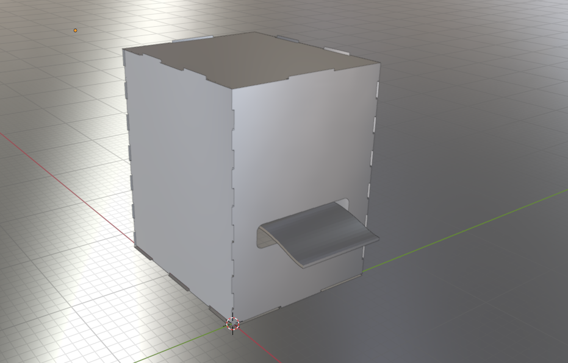
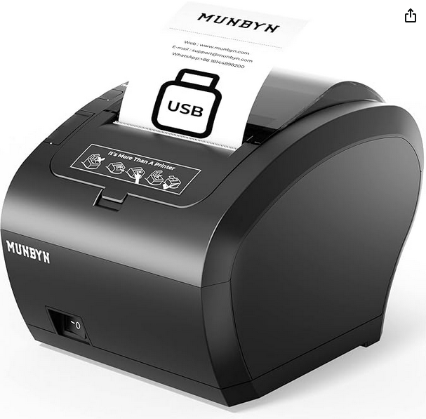
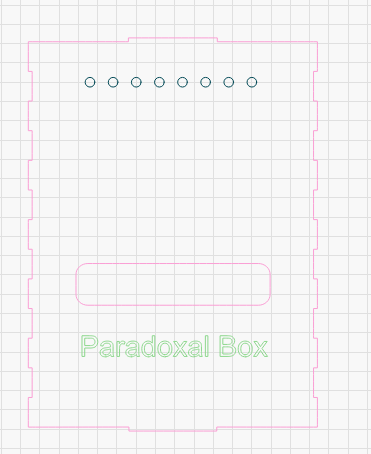
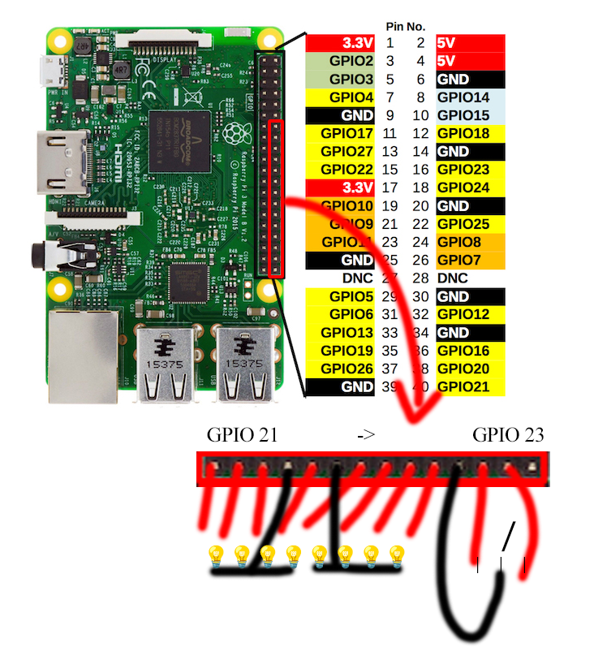
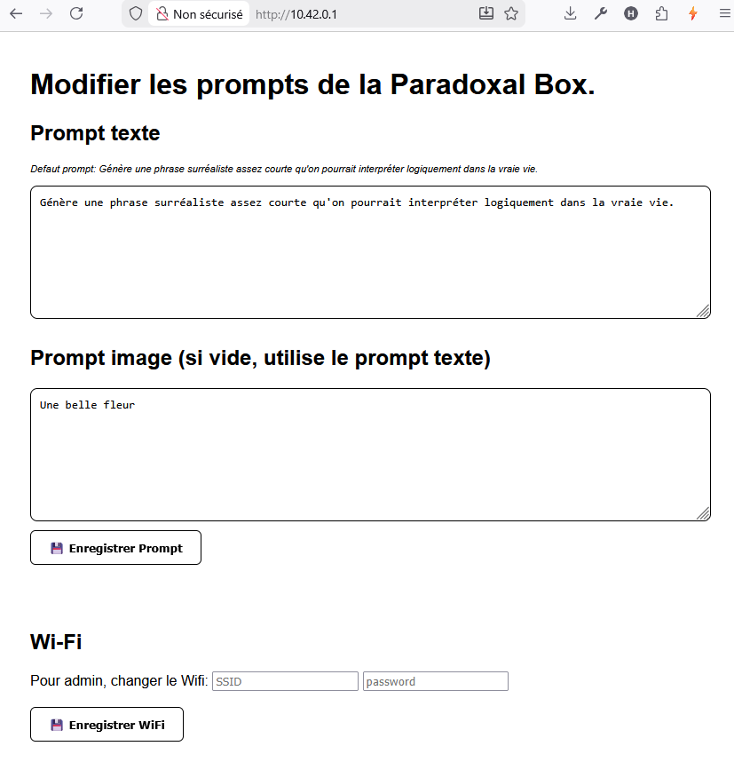

## Attention, il faut une clé OPENAI ! Bonjour, poursuivez votre lecture


## Hardware


### La boite

[video demo](demo.gif)


Pour modification la version 3D blender: [thebox.blend](thebox.blend)




Branchez une imprimante USB de ticket de caisse.

Pour moi: "MUNBYN Imprimante Thermique de reçus P047"  https://www.amazon.fr/dp/B0BRZ4VZD1


Avec des rouleaux https://www.amazon.fr/dp/B0CVB9BC68


Pour imprimer la boite j'ai pris du contreplaqué, 300x200x2mm Feuilles de Tilleul

Graver avec LightBurn, fichier [paradoxalbox-lightburn.lbrn2](paradoxalbox-lightburn.lbrn2)

ou en utilisant les fichiers .svg et image-\*.png



### Connectez les LEDs et l'interrupteur

Tester la connectique avec test\_gpio.py et test\_bouton.py


### Configuration

Editez le .env

Mettez votre clé OPENAI\_API\_KEY ainsi que PRINTER\_VENDOR\_ID et PRINTER\_PRODUCT\_ID

vous pouvez les trouver avec la commande lsusb :
```
Bus 001 Device 002: ID 0483:5743 STMicroelectronics printer-80
```
Ici 0483 est le vendor id et 5743 le product id


## Software

Copiez tous les fichiers dans ~/
Lancez
```sudo install.sh``` (non testé lol !)

Si vous avez un dongle wifi, vous pouvez obtenir un réseau RaspberryBox (password 12345678) qui permet de se connecter à la box pour setter le Wifi domestique, quand vous bouger la box chez les voisins.
Autrement répondez non lors de l'installation

### 

## Next

Connectez vous à la box http://192.168.1.x (ou http://10.42.0.1 si wifi de la box)

Modifiez le prompt du texte et de l'image

## 

## Setup Wifi

Si vous avez ajouter un dongle wifi, vous pouvez configurer un deuxième wifi sur wlan0 pour se connecter direct à la box via le wifi ParadoxalBox et modifier le SSID si vous changez de wifi domestique


